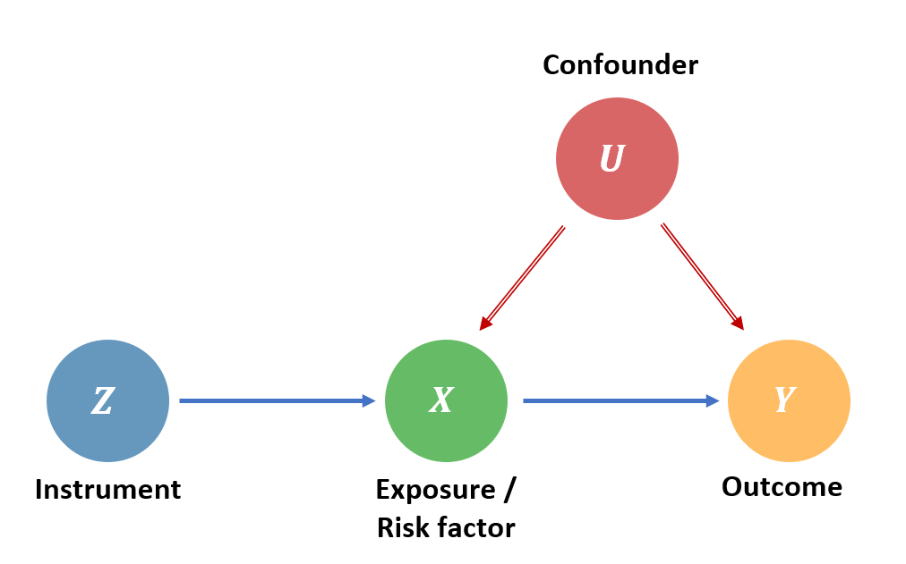

```{r setup, include=FALSE}
knitr::opts_chunk$set(echo = TRUE, warning = FALSE, message = FALSE)
setwd("../MR/")
```

## Prerequisites
There are several requirements for completing this exercise.

1.  R studio with R version \>3.3.
2.  R packages gsmr2, MendelianRandomization, and dplyr. For most users executing the `install.packages("dplyr")` ensures this.

The gsmr2 package can be installed via GitHub:

```{r, include=FALSE}
# gsmr requires the R-package(s)
# install.packages(c('survey'));
# install gsmr2
# install.packages(devtools::install_github("jianyanglab/gsmr2"))

```


```{r, echo = FALSE}
library(dplyr)
library(gsmr2)
library(MendelianRandomization)
```

## Exercises

In this practical session, we will work on Mendelian Randomisation (MR) using the GSMR2 package. You will:

 - Simulate GWAS summary statistics for two traits, a risk factor and an outcome
 - Estimate the causal relationship between this exposure and outcome
 - Apply Egger's regression and HEIDI-outlier analysis to attempt to account for pleiotropy
 
<br>

### Two-sample MR



##### Q1: Look at the diagram above. What are the three assumptions G must fulfill in order to be used as an instrumental variable?

#### Simulating GWAS summary statistics

We'll start by simulating GWAS data for two traits:

 1. Exposure (e.g., BMI)
 2. Outcome (e.g., Systolic Blood Pressure)

```{r}

set.seed(17)

# Number of SNPs
num_snps <- 1000

# SNP IDs
snp_ids <- paste0("rs", 1:num_snps)

# Simulate effect sizes and standard errors for exposure
beta_x <- rnorm(num_snps, 0, 0.05)  
se_x <- rnorm(num_snps, 0.01, 0.005)

# Simulate effect sizes and standard errors for outcome
beta_y <- beta_x * 0.2 + rnorm(num_snps, 0, 0.05)
se_y <- rnorm(num_snps, 0.01, 0.005)

# Simulate p-values for exposure and outcome
pval_x <- 2 * pnorm(-abs(beta_x / se_x))
pval_y <- 2 * pnorm(-abs(beta_y / se_y))

# Simulate allele frequencies
freq <- runif(num_snps, 0.1, 0.5)

# Assume a constant sample size for GWAS studies of both traits
sample_size_x <- 10000
sample_size_y <- 50000

```

##### Q2: Read through the above code. How do we simulate the SNP effect sizes for the exposure and the outcome? 

##### Q3: Are the three assumptions of MR met in our simulation?

<br> 

#### Prepare the data for GSMR

We need to format the data for analysis as GSMR takes its own specific format. It requires the following columns:

 - SNP: the ID of the instrumental variable
 - a1_freq: frequency of a1
 - bzx: the effect size of a1 on risk factor
 - bzx_se: standard error of bzx
 - bzx_pval: p value for bzx
 - bzx_n: per-SNP sample size of GWAS for the risk factor
 - bzy: the effect size of a1 on disease
 - bzy_se: standard error of bzy
 - bzy_pval: p value for bzy
 - bzy_n: per-SNP sample size of GWAS for the disease

##### Q3: Reformat your simulated data into one dataframe containing the above-mentioned columns.

```{r}

gsmr_data <- "?"


```


<br>

#### LD correlation matrix

Typically the LD correlation matrix is estimated from genotype data, but in this session we will simply simulate it:

```{r}
# Decay rate of the correlations
rho <- 0.6

# Function to simulate LD correlation with decaying structure
ld_decay <- function(i, j, rho = rho) {
  rho^abs(i - j)
}

# Initialize an empty matrix
ldrho <- matrix(NA, nrow = num_snps, ncol = num_snps)

# Fill the LD matrix with correlations using the decay function
for (i in 1:num_snps) {
  for (j in 1:num_snps) {
    ldrho[i, j] <- ld_decay(i, j, rho = rho)  # rho controls the decay rate of the correlation
  }
}

# Add SNP IDs as row and column names
rownames(ldrho) <- snp_ids
colnames(ldrho) <- snp_ids

# Check the dimension of the LD matrix
dim(ldrho)

# Display the first few rows and columns of the simulated LD matrix
ldrho[1:5, 1:5]

```
The parameter `rho` is the decay rate of correlation between SNPs.

##### Q4: How would changing `rho` affect the correlation structure, and how might this influence our MR analysis?

<br>

#### SNP effect standardization

It is advantageous to standardize SNP effect sizes from the risk factor GWAS before performing GSMR.

##### Q5: Use the `std_effect()` function to standardize `bzx` and `bzx_se`. Save the two new columns in `gsmr_data` as `std_bzx` and `std_bzx_se` respectively.

<br>

#### Running GSMR

We can now run GSMR using the standardized SNP effects.

##### Q6: Run GSMR using the `gsmr()` function.

```{r}

gsmr_result <- "?"

```


```{r}
cat("The estimated effect of the exposure on outcome: ", gsmr_result$bxy)
cat("\n The standard error of bxy: ",gsmr_result$bxy_se)
```

##### Q7: What is the result of the analysis? What does it signify?

<br>

### Accounting for Pleiotropy

#### HEIDI-outlier filtering

Pleiotropy occurs when SNPs affect both the exposure and the outcome, which can bias the results when the effect is through pathways other than the intended causal pathway. To account for pleiotropic bias, we can run GSMR with HEIDI-outlier filtering.

##### Q8: Rerun the GSMR analysis with `heidi_outlier_flag = T` and a p-value threshold for the multi-SNP-based global HEIDI-outlier flag of 0.01.

```{r}

gsmr_heidi_result <- "?"

```

```{r}
cat("The estimated effect of the exposure on outcome: ", gsmr_heidi_result$bxy)
cat("\n Standard error of bxy: ", gsmr_heidi_result$bxy_se)
```

##### Q9: How does the estimated effect of the exposure on the outcome change after applying HEIDI-outlier filtering compared to before?

##### Q10: How does HEIDI-outlier filtering detect potential pleiotropic SNPs? See the [**paper**](https://www.nature.com/articles/ng.3538)

<br>

#### Egger's regression

In MR, Egger's regression is a another technique used to detect and account for pleiotropy, where the intercept of the regression represents the average pleiotropic effect.

```{r}
# Create an MRInput object
mr_input_data <- with(gsmr_data, mr_input(bx = bzx, bxse = bzx_se, by = bzy, byse = bzy_se))

# Perform MR-Egger regression
egger_result <- mr_egger(mr_input_data)

# Display the results
print(egger_result)

# Extract and interpret the results
causal_estimate <- egger_result@Estimate
intercept <- egger_result@Intercept
intercept_pvalue <- egger_result@Pvalue.Int

cat("Causal estimate (Egger):", causal_estimate, "\n")
cat("Egger intercept (Pleiotropy):", intercept, " (p-value:", intercept_pvalue, ")\n")

```

##### Q11: Inspect the results. What is the intercept? 

<br>

#### Summing up

By working a bit with the data, we should now have a clearer answer for Q3 than we did in the beginning. Therefore, knowing what you know now, answer this question again:

##### Q12: Are the three assumptions of MR met in our simulation? 

